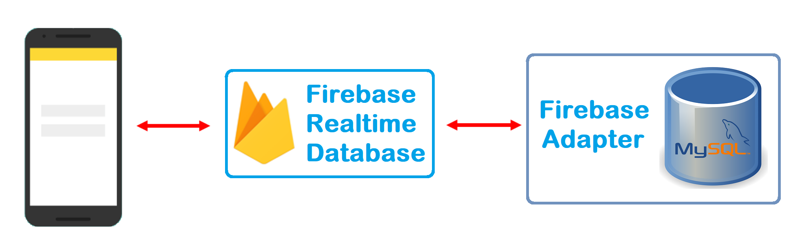

# MySQL4Firebase
MySQL4Firebase is a server side Java program which connects a MySQL database to a Firebase app.

 

It allows you to call SQL statements from a mobile device. 

### Installation Gude

 * create a new Firebase project 
 
 * create a service account JSON file for your project and download it
 
 * update the file `config/firebase.config.template.xml` file. Change the location of your service account
   JSON file and change the database URL. Then rename the file to `firebase.config.xml`.
   
 * install the [northwind sample database](https://github.com/easonchan1113/northwindextended) in your MySQL or 
   MariaDB database. 
  
 * in the `config` directory edit the `mysql.config.xml` file and update the following entries
      
     `<entry key="password">bitnami</entry>`
     
     `<entry key="database">northwind</entry>`
     
     `<entry key="username">root</entry>`
     
     `<entry key="serverName">192.168.188.92:3306</entry> `
   
 * copy the security rules from the file `config/security_rules.json` to the Firebase database
 
 * execute the main method of class FirebaseMySQLClient
 
 * now you can use the demo app from  [MySQL4FirebaseApp](https://github.com/cordjastram/MySQL4FirebaseApp) to call 
   SQL statements from your mobile app.

